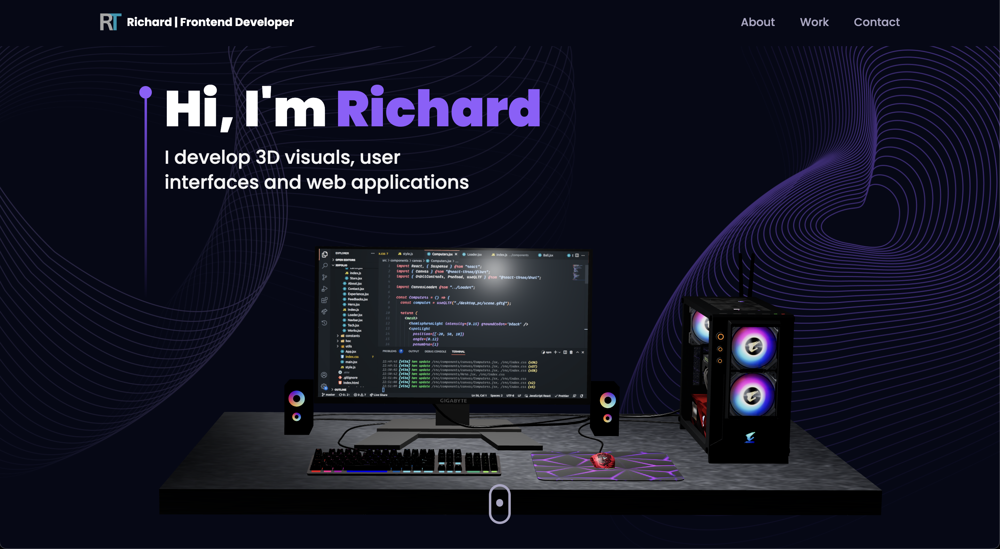
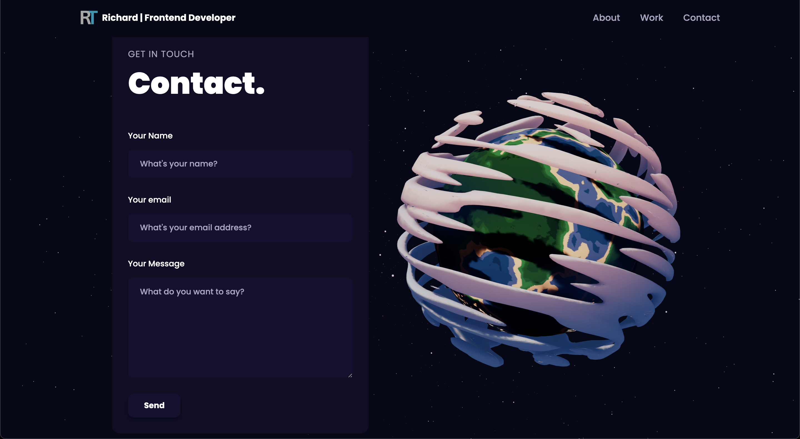

# My 3D Portfolio/Landing page

This is my portfolio which will be continually improved overtime.

## Table of contents

- [Overview](#overview)
  - [Screenshot](#screenshot)
  - [Links](#links)
- [My process](#my-process)
  - [Built with](#built-with)
  - [What I learned](#what-i-learned)
  - [Continued development](#continued-development)
- [Author](#author)
- [Acknowledgments](#acknowledgments)

## Overview

### Screenshot

Interactive Main Page:

Interactive Contact Page:

### Links

- [View Github Repository](https://github.com/r-tom90/3d-portfolio.git)
- [View Live Site](richardtom.site)

## My process

### Built with

- Mobile-first Workflow
- CSS Custom Properties
- [Tailwind CSS](https://tailwindcss.com/#what-is-tailwind) - For styles
- [React](https://reactjs.org/) - JS library
- [Vite](https://vitejs.dev/) - React Bootstrap
- [ThreeJS](https://threejs.org/)
- [React Three Fiber](https://docs.pmnd.rs/)
- [Framer Motion](https://www.framer.com/motion/)
- [3D Models from SketchFab](https://sketchfab.com/)
- [React Vertical Timeline Component](https://www.npmjs.com/package/react-vertical-timeline-component?activeTab=readme)
- [EmailJS](http://emailjs.com/)

### What I learned

- Reusable and scalable code using Higher Order Components (HOCs) and other industry-standard best practices.
- ThreeJS: A powerful 3D graphics library for rendering and animating the 3D model
- React Three Fiber: a popular library for creating 3D graphics with ThreeJS in React
- Framer Motion: The most popular library used to bring your React website to life with animations
- Load, create and customize stunning 3D models and geometries with various lights, as well as understand the 3D world with a camera and positioning of an object in space.
- Ensure responsiveness across all devices and improve your site's performance using Suspense and Preload.
- EmailJS: Implement sending emails through a form on the website with only a few lines of code for seamless integration.

### Continued development

- Implementation of:
  - [] Light Mode
  - [] Blogging
  - [] Web3 Authentication with NFT

## Author

- Website - [richardtom.site](https://richardtom.site)
- GitHub - [@r-tom90](https://github.com/r-tom90)
- LinkedIn - [@richard-tom](https://www.linkedin.com/in/richard-tom-81b0956b/)
- Twitter - [@CryptoFallen](https://twitter.com/CryptoFallen)
- Medium - [@richardtom](https://medium.com/@richardtom_79153)

## Acknowledgments

Special thanks and thanks to Adrian, this portfolio was built with the tutorial from [the JavaScript Mastery YouTube Channel](https://www.youtube.com/watch?v=0fYi8SGA20k).
